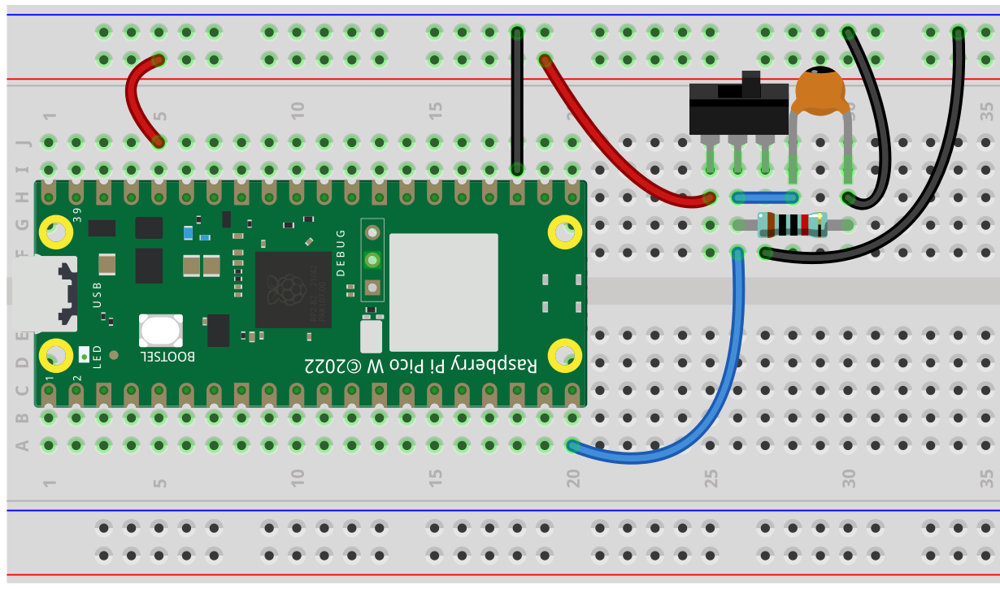

# 🦉 Tutorial 6 - Toggle Switch

### Components Needed

| Component           |          |
| ------------------- | -------- |
| Raspberry Pi Pico W | 1        |
| Micro USB Cable     | 1        |
| Breadboard          | 1        |
| Wires               | Several  |
| Resistor            | 1 - 10KΩ |
| Tilt Switch         | 1        |

### Fritzing Diagram

<figure><figcaption><p>Frtizing Breadboard Diagram</p></figcaption></figure>

### Code

```python
from machine import Pin
import utime
button = machine.Pin(15, machine.Pin.IN)
while True:
    if button.value() == 0:
        print("The switch works!")
        utime.sleep(1)
```

### Code Explanation
